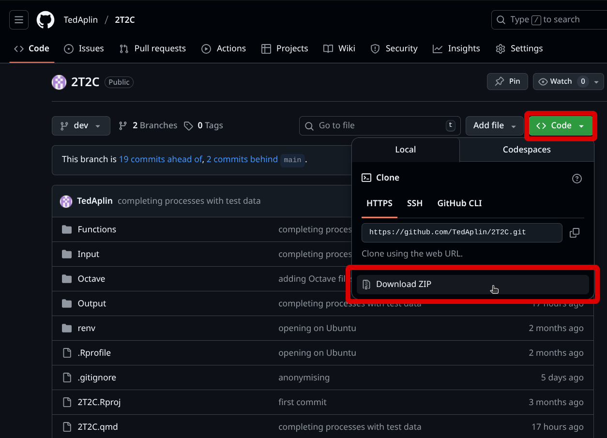

# About

This is a data processing pipeline for Fluorescent imaging data (specifically calcium imaging)

This project takes intensometric or ratiometric fluorescence data measured using ImageJ and can:

1.  **Add extra data** such as sensors used, time intervals and names of ROIs

2.  Conduct **simple calculations** such as ratio and removal of background

3.  **Export the data** in file formats more suitable for further data analysis

4.  Quickly **create graphs** for initial visual analysis of fluorescent activity

5.  **Combine** multiple processed Data-sets into one and compare the average background intensity of each

# Installation

## prerequisites

Should work with any operating system and with many versions of R and Rstudio, the specific versions I Used are as follows

-   **R** 4.5.1 <https://cran.rstudio.com>

-   **Rstudio** 2025.09.01 <https://posit.co/download/rstudio-desktop/>

-   **renv** 1.1.5 (comes preinstalled with R 4.5.1, you can use the Rstudio package manager to install or update it if it is not present and correct)

## Downloading

### **Using Git commands**

Open terminal and move to whatever location you want the files to download then run:

``` bash
git clone https://github.com/TedAplin/2T2C.git
```

### Manually

1.  Click on the green "Code" button above the files on the github page

{width="528"}

2.  Click on Download ZIP at the bottom of the popup window

3.  Extract the files in the ZIP folder to wherever you want the project to be located

## First time initialisation

This installs all the required packages from the "renv.lock" file so that you can use the code. If issues start happening, it is worth running these instructions again to re-install all packages.

1.  Open the project by opening the "2T2C.Rproj" file with Rstudio

2.  In the Files page in the bottom right, open up "initialisation.R"

3.  Press Ctrl + A then run

4.  press yes to any prompts in the console to install all packages

# Usage

## File Input
