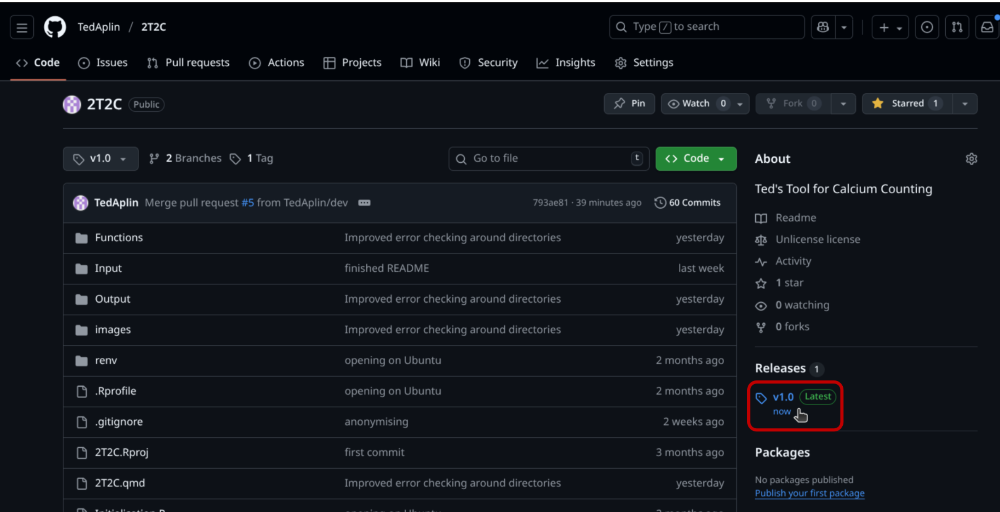
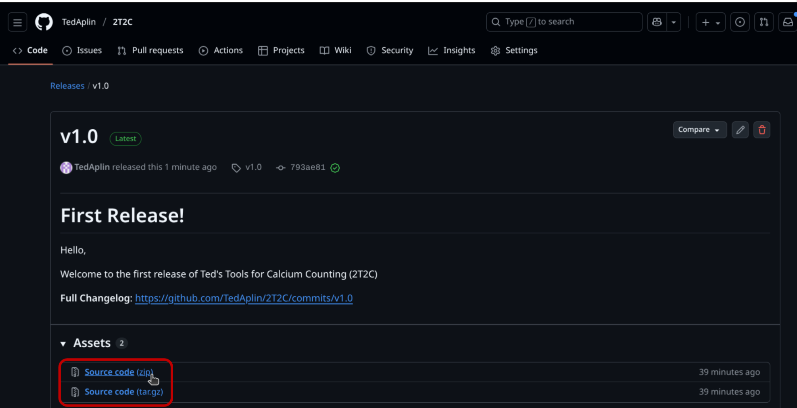

# Ted's Tools for Calcium Counting - 2T2C

[](https://doi.org/10.5281/zenodo.17417728)

-   [About](#about)

    -   [IMPORTANT NOTES](#important-notes)

-   [Installation](#installation)

    -   [Prerequisites](#prerequisites)

    -   [Downloading](#downloading)

    -   [First time initialisation](#first-time-initialisation)

-   [Usage](#usage)

    -   [Demonstration files](#demonstration-files)

    -   [File Input](#file-input)

    -   [Running the scripts](#running-the-scripts)

-   [Making modifications (Advanced)](#making-modifications-advanced)

## About {#about}

This is a data processing pipeline for Fluorescent imaging data (specifically calcium imaging)

This project takes intensometric or ratiometric fluorescence data measured using ImageJ and can:

1.  **Add extra data** such as sensors used, time intervals and names of ROIs

2.  Conduct **simple calculations** such as ratio and removal of background

3.  **Export the data** in file formats more suitable for further data analysis

4.  Quickly **create graphs** for initial visual analysis of fluorescent activity

5.  **Combine** multiple processed Data-sets into one and compare the average background intensity of each

### IMPORTANT NOTES {#important-notes}

-   **ONCE YOU HAVE LOOKED AT THE DEMONSTRATION DATA, IT IS BEST TO REMOVE IT FROM THE FOLDERS, YOU CAN ALWAYS REDOWNLOAD IT LATER**

-   **AT NO POINTS IS DATA IN THE INPUT FOLDER DELETED OR OVERWRITTEN BY THE SCRIPTS, HOWEVER DATA IN THE OUTPUT FOLDERS CAN BE**

-   **ENSURE TO INITIALISE BEFORE RUNNING**

    -   **RUN "INITIALISATION.R" (ONLY REQUIRED BEFORE THE FIRST TIME)**

    -   **RUN THE INITIALISATION SCRIPT (REQUIRED EVERY TIME YOU OPEN "2T2C.QMD")**

## Installation {#installation}

### prerequisites {#prerequisites}

Should work with any operating system and with many versions of R and Rstudio, the specific versions I Used are as follows

-   **R** 4.5.1 <https://cran.rstudio.com>

-   **Rstudio** 2025.09.01 <https://posit.co/download/rstudio-desktop/>

-   **renv** 1.1.5 (comes preinstalled with R 4.5.1, you can use the Rstudio package manager to install or update it if it is not present and correct)

### Downloading {#downloading}

**Cloning the current main channel**

Open terminal and navigate to whatever location you want the files to download then run:

``` bash
git clone https://github.com/TedAplin/2T2C.git
```

**downloading the latest release**

1.  if you're on the main github page, then go to the latest release on the right hand side



2.  Download as a .zip (or tar.gz if you prefer)



2.  Extract the files in the ZIP folder to wherever you want the project to be located

### First time initialisation {#first-time-initialisation}

This installs all the required packages from the "renv.lock" file so that you can use the code. If issues start happening, it is worth running these instructions again to re-install all packages.

1.  Open the project by opening the "2T2C.Rproj" file with Rstudio

2.  In the Files page in the bottom right, open up "initialisation.R"

3.  Press Ctrl + A then run

4.  press yes to any prompts in the console to install all packages

## Usage {#usage}

### Demonstration files {#demonstration-files}

**Before using 2T2C with your own data, I would recommend using the test data.**

This data comes in the form of 4 .csv files: Test WT 1+2 and Test Mut 1+2.

When you first download this project the contents of the Input and output folder are what they would be after running the scripts on the demonstration data:

-   The Input folder contains the 4 demonstration data sets

    -   it also contains the combined version of these as "Test Batch Dataset.csv"

    -   In the Batch folder are the already processed version of the demonstration data sets for use with batch processing

-   The Output folder contains all of the outputs from running these 4 datasets through the scripts

    -   All of the extended and rearranged datasets

    -   All of the graphs and PNGs and SVGs

This allows you to see how Input data sets should look as well as how they are modified by the scripts. You can also run these data sets through the scripts using the instructions below to see how they function.

Once you have looked through this it may be best to delete them to remove clutter, but make sure that you **DO NOT DELETE THE INPUT, OUTPUT FOLDERS, OR ANY SUBFOLDERS!**

### File Input {#file-input}

Files should be placed in the "Input Folder".

2T2C accepts files that have been generated by the ImageJ ROI measure tool with (at least) the Mean intensity, Channel and frame data present. If there are extra columns than these they will not be read.

The file should of the format .csv and look something like this:

|     | Mean | Ch  | Frame |
|-----|------|-----|-------|
| 1   | \-   | 1   | 1     |
| 2   | \-   | 2   | 1     |
| 3   | \-   | 1   | 1     |
| 4   | \-   | 2   | 1     |

If you are unsure how to use the ImageJ ROI measure tool or are having difficulties creating Input files that will be accepted I recommend using the "Measure ROI" macro from my Fiji macro toolkit, accessible at: <https://github.com/TedAplin/Fiji-Macro-Toolkit>

### Running the scripts {#running-the-scripts}

All scripts are found in the file "2T2C.qmd"

I would recommend running them in order, as some scripts require previous scripts to have been run.

**MAKE SURE YOU HAVE RUN "INITIALISATION.R" BEFORE RUNNING ANY SCRIPTS.**

**RUN THE INITIALISATION SCRIPT EVERY TIME YOU OPEN 2T2C.QMD, BEFORE YOU RUN ANY OTHER SCRIPT.**

Scripts are split into 3 components:

1.  Pre-text

This explains what the script does and gives some information on how to use it:


2.  The Script itself

This is where you enter your parameters and run the script. It has extra information on what to put in each line.

**ONLY EDIT THE VALUES ON THE RIGHT HAND SIDE OF THE ARROWS, OR ELSE THE SCRIPT WILL BREAK.**

At the bottom of each script is a section which runs the script based on your parameters, **do not modify this section.**

When you want to run a script, press the green play button in the top right (highlighted with a red box in this image):


**if there is an issue running a block, then I would recommend pressing the grey arrow to the left of the green one, this will run any script before this one.**

3.  The Output

When you run a script a new text box opens underneath it showing you updates of the script's progress as it occurs.

If a new file is created it will tell you where it has been created to help you find it.

For errors, I have tried to predict as many mistakes people could make when using these scripts and have written personalised error messages with advice on how to fix them. As you can see marked with blue below. This set of error checks is by no means all inclusive and you may find yourself stuck without the help of my past self.


## Making modifications (Advanced) {#making-modifications-advanced}

if you wish to make changes to my code to make it better suit your needs, then the code for all of my functions can be found in "Functions/Functions for 2T2C.R". Feel free to make changes or add your own functions.

But for less advanced users, this code is far less user oriented that the code found in "2T2C.qmd" and is a lot harder to work with.
